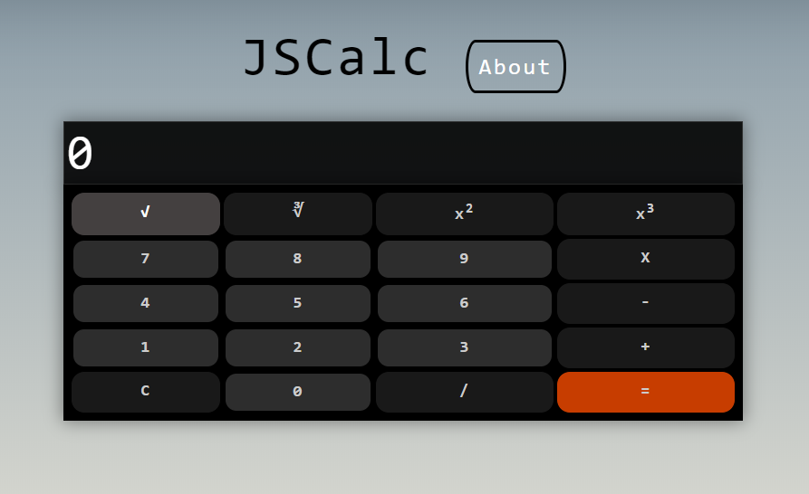

# JSCalc
> A simple web calculator using HTML, CSS and JavaScript.

## Usage instructions
The calculator is very simple to use and supports both *keyboard* and *mouse* input.
The usable **shortcuts** are as follows:

- numbers from <kbd>0</kbd> to <kbd>9</kbd> to type a number
- <kbd>*</kbd> to multiply
- <kbd>-</kbd> to subtract
- <kbd>+</kbd> to add
- <kbd>c</kbd> / <kbd>C</kbd> or <kbd>ESC</kbd> to delete the display content
- <kbd>/</kbd> to divide
- <kbd>ENTER</kbd> to get the result

## Release History

* 0.0.1 - 11/08/2020
    * JSCalc release

## Online demo
[JSCalc demo](https://github.com/leonardo-arditti/JSCalc)
_For further information and usage, refer to the [About] [about] section within the page._
